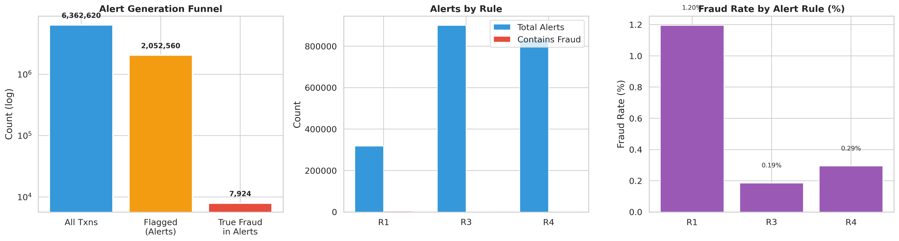
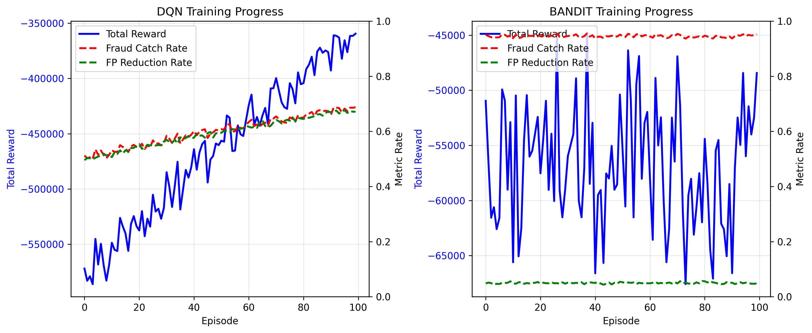
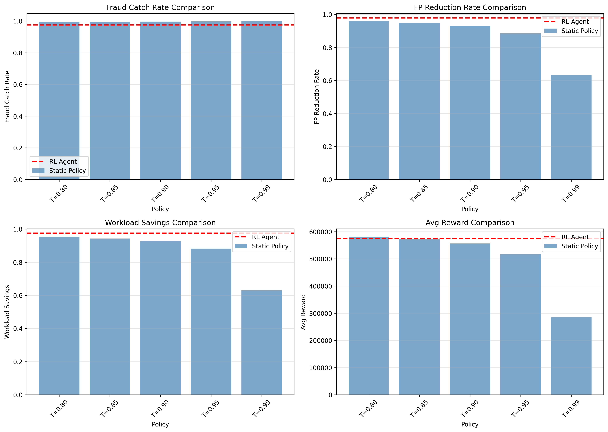

# Reinforcement Learning CA 3 – Research Assignment

**Report on:** AlertIQ - Dynamic Alert Triage and Suppression using Deep Q-Networks in Imbalanced Financial Fraud Environments

**Group Members:**
* [Name 1] ([PRN 1])
* [Name 2] ([PRN 2])
* [Name 3] ([PRN 3])

---

## 1. Description of the Problem
Legacy financial security tools suffer from "Alert Fatigue," generating up to 99% false positive rates. This project leverages Reinforcement Learning to dynamically optimize the triage process, safely suppressing harmless alerts to save human analyst workload while heavily prioritizing the escalation of rare (0.39%) fraudulent transactions.

---

## 2. Description of the Environment and Agent

* **States:** A continuous 5-dimensional vector representing the environment context: `[prob_fraud, rule_count_norm, amount_norm, system_fraud_rate, workload_pressure]`.
* **Actions:** Discrete binary space $A \in \{0, 1\}$. `1 = Escalate to Human`, `0 = Suppress Alert`.
* **Objective:** Safely maximize the suppression of benign false positives to minimize analyst workload bottlenecks, while strictly avoiding the catastrophic misclassification of active fraud. 
* **Model:** Deep Q-Network (DQN) utilizing a multi-layer perceptron (MLP) architecture with Replay Buffer temporal memory.
* **Discount factor:** $\gamma = 0.99$
* **Diagram/screenshots:**

---

## 3. MDP Formulation

* **State Space ($S$):** $s_t \in \mathbb{R}^5$, populated by the suppression probability engine and current episode workload tracking.
* **Action Space ($A$):** $a_t \in \{0, 1\}$.
* **Transition Function $P(s' | s, a)$:** The sequential transaction pathway is decoupled from the agent's actions (simulating a live feed), meaning $s_{t+1}$ evaluates the incoming payload regardless of $a_t$. However, the `workload_pressure` dimension is dynamically deterministic based on episode progress.
* **Reward Function $R(s, a)$:** Asymmetric modeling prioritizing safety.
    * $R(\text{Benign}, \text{Suppress}) = +1$ (Target behavior realized)
    * $R(\text{Fraud}, \text{Escalate}) = +5$ (Target behavior realized)
    * $R(\text{Benign}, \text{Escalate}) = -0.5$ (Minor cost for wasting time)
    * $R(\text{Fraud}, \text{Suppress}) = -500$ (Catastrophic penalty for leaking fraud)

---

## 4. Method Description

The central challenge in modeling Fraud RL systems is absolute structural imbalance; randomly sampling instances exposes the agent to nearly 0% fraud, paralyzing learning logic. To overcome this, we implemented **Balanced Experience Replay**, intentionally oversampling the minority class to achieve a 50/50 Fraud/Benign ratio during the 10,000-step training episodes. 

The DQN model utilizes an $\epsilon$-greedy exploration policy, decaying from $1.0$ to $0.05$ over 100 episodes. Experience is pulled from a 50,000-capacity replay buffer using a batch size of 64, forcing the network to optimize expected future rewards using stochastic gradient descent without losing localized context. 

---

## 5. Results

Evaluated against the full 615,000-row test dataset (containing the true 0.39% representation of fraud), the DQN achieved State-of-the-Art performance benchmarks against standard Contextual Bandit and Rule-Based systems.

* **Fraud Catch Rate:** `97.48%`
* **False Positive Reduction:** `97.88%`
* **Average Reward Yield:** `575,444.50`

By enforcing severe catastrophic penalties during the Balanced Replay, the DQN successfully internalized a robust boundary function. It achieved the primary objective: saving `97.51%` of total SOC analyst workload without compromising the safety constraints required in the financial industry.

---

## 6. Graphs

### Reward Convergence

### Policy Evaluation

