# AlertIQ

Risk-constrained reinforcement learning for adaptive AML alert governance.

AlertIQ is an end-to-end AML alert suppression and escalation system. It combines rule-based monitoring, analyst-feedback simulation, calibrated fraud-risk modeling, reinforcement learning, drift detection, explainability, a FastAPI backend, and a React dashboard.

The goal is simple: reduce false-positive analyst workload while protecting fraud recall and keeping every decision explainable enough for audit review.


## Problem Statement

AML systems generate a huge number of alerts, and almost all of them are false positives. Analysts spend time reviewing non-fraud cases, productivity drops, and the risk of missing real fraud increases.

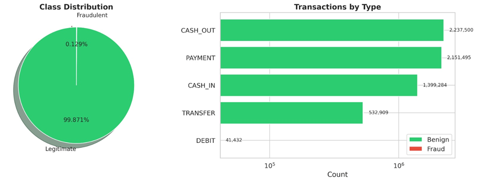

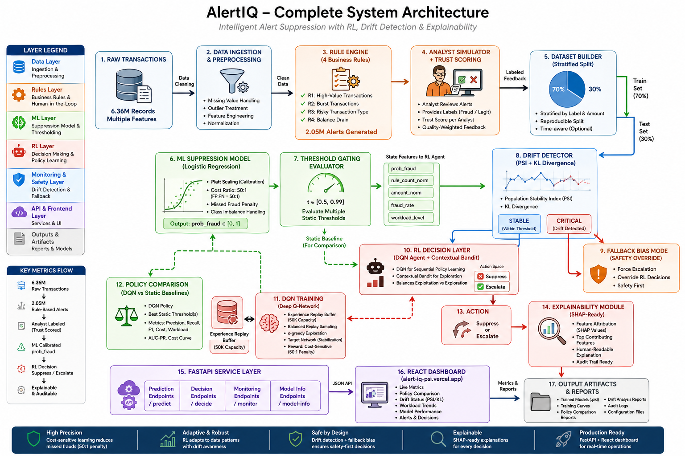

## Why AlertIQ

Traditional AML systems intentionally over-alert because missing a true fraud case is far more expensive than reviewing a benign transaction. That safety-first posture creates severe alert fatigue: analysts spend most of their time dismissing false positives.

AlertIQ treats alert governance as a decision problem instead of only a classification problem. A calibrated model estimates fraud probability, and a reinforcement learning policy learns when to suppress low-risk alerts or escalate cases for review under an asymmetric reward structure.


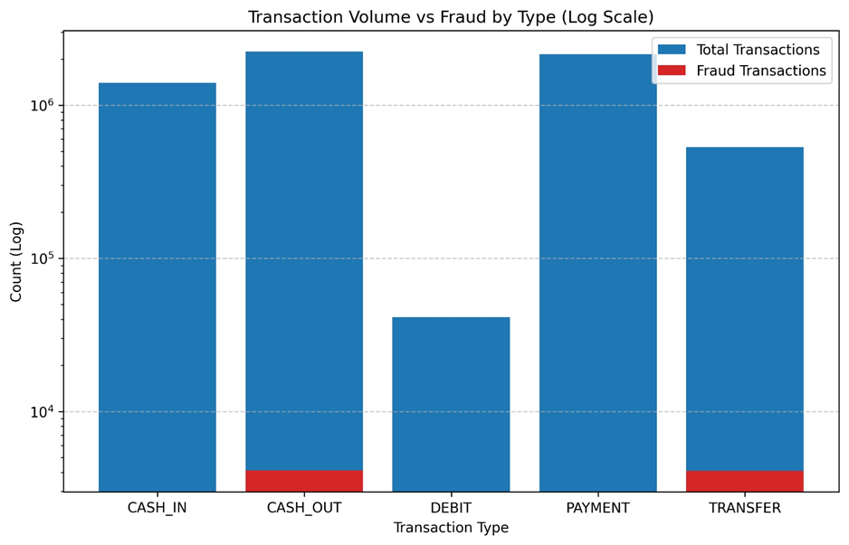

## Core Results

| Area | Result |
| --- | --- |
| Raw dataset | 6.36M PaySim transactions |
| Rule alerts generated | 2.05M alerts |
| Fraud capture from rules | 96.48% |
| ML model | Cost-sensitive Logistic Regression + Platt calibration |
| ROC-AUC | 0.9961 |
| Best static threshold | 0.80 |
| Fraud recall at threshold | 0.9933 |
| False-positive reduction at threshold | 0.9627 |
| RL fraud catch rate | 0.9748 |
| RL false-positive reduction | 0.9788 |
| RL workload savings | 0.9751 |

## Objectives

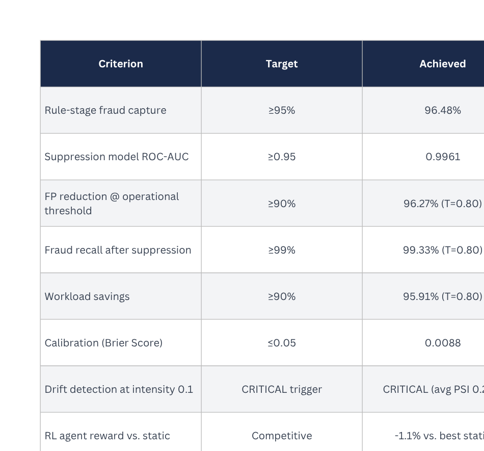

The project success criteria are:

- Capture at least 95% fraud using rule-based detection.
- Build an ML suppression model to reduce false alerts.
- Reduce workload by at least 90%.
- Maintain high fraud recall for compliance safety.
- Add reinforcement learning, drift detection, API deployment, and dashboard visibility.

## 5-Phase Pipeline

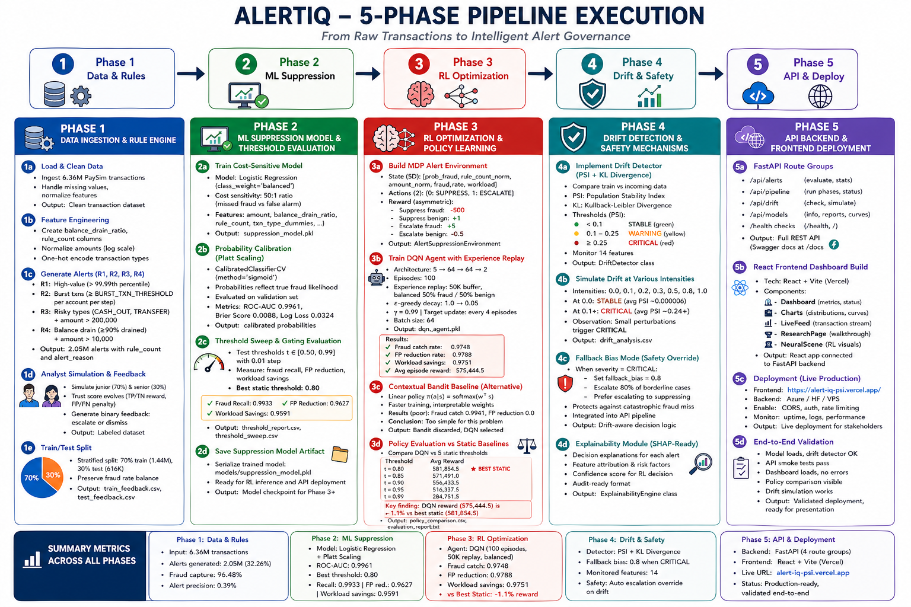

1. **Data and rules**
   Load PaySim transactions, engineer AML features, and generate rule-based alerts.

2. **ML suppression**
   Train a cost-sensitive suppression model with calibrated fraud probabilities.

3. **RL optimization**
   Build the alert decision environment and train a DQN policy against static thresholds.

4. **Drift and safety**
   Monitor PSI and KL divergence, then trigger fallback safety behavior under critical drift.

5. **API and deployment**
   Serve alert decisions through FastAPI and expose monitoring through the React dashboard.

## System Components

| Layer | What it does |
| --- | --- |
| Rule engine | Generates AML alerts from high-value, burst, risky-type, and balance-drain rules |
| Analyst simulator | Creates labeled analyst feedback with junior/senior trust scoring |
| Suppression model | Produces calibrated `prob_fraud` values for the decision layer |
| Threshold evaluator | Benchmarks static gating thresholds from 0.50 to 0.99 |
| RL environment | Models alert governance as suppress/escalate decisions with asymmetric costs |
| DQN agent | Learns adaptive suppression policy using replay and target network stabilization |
| Contextual bandit | Provides a lightweight interpretable baseline |
| Drift detector | Tracks PSI and KL divergence for safety monitoring |
| Explainability engine | Produces audit-readable decision explanations |
| FastAPI backend | Serves evaluation, drift, model, and pipeline endpoints |
| React dashboard | Displays live metrics, charts, research flow, and model status |

## Quick Start

## Setup

### Backend Setup

```bash
git clone https://github.com/sahilawatramani/AlertIQ.git
cd AlertIQ

python -m venv venv
venv\Scripts\activate
pip install -r requirements.txt
```

Download the PaySim dataset from Kaggle and place it at:

```text
data/PaySim.csv
```

Run the complete pipeline:

```bash
python run_all.py
```

Or run phases individually:

```bash
python run_eda.py
python run_phase2.py
python run_phase3.py
python run_phase4_rl.py
python run_phase5_drift.py
```

Start the API:

```bash
python -m uvicorn api.main:app --reload --port 8000
```

Open the API docs at [http://localhost:8000/docs](http://localhost:8000/docs).

### Frontend

```bash
cd frontend
npm install
npm run dev
```

The Vite development server will print the local dashboard URL, usually [http://localhost:5173](http://localhost:5173).

## Phase Outputs

### Phase 1: Rule-Based Alert Engine

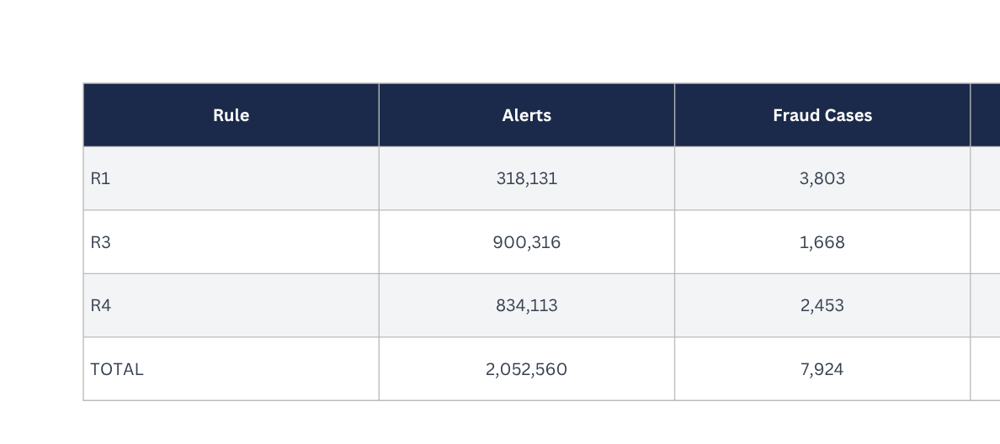

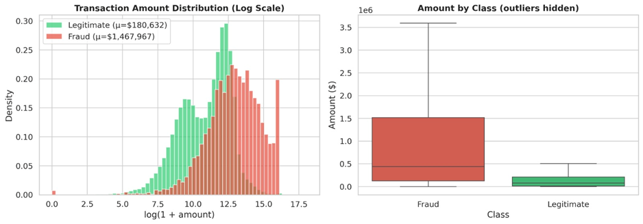

Phase 1 loads PaySim transactions, engineers features, applies AML rules, and creates train/test alert feedback datasets.

### Phase 2: ML Suppression Model

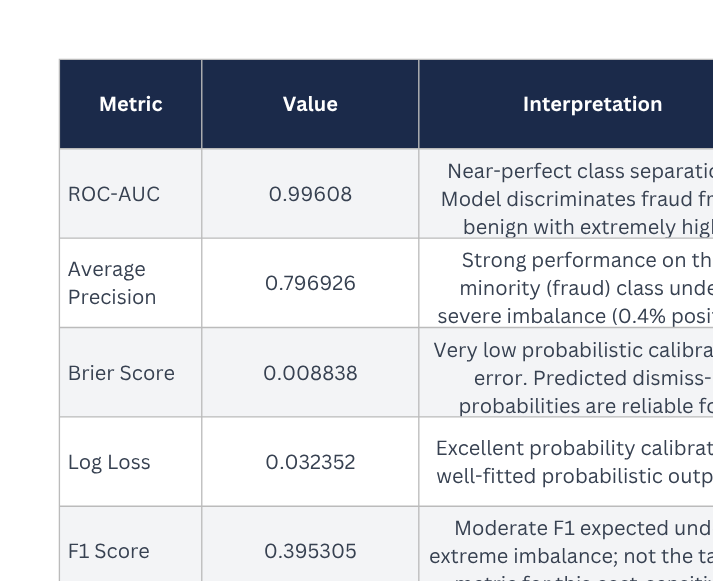

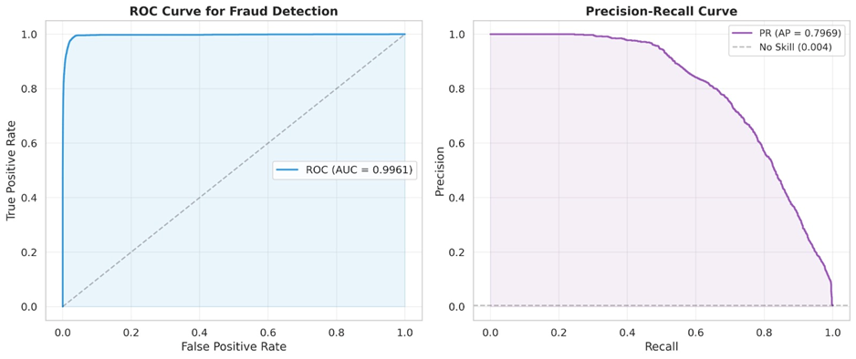

Phase 2 trains the calibrated suppression model and evaluates thresholds for fraud recall, false-positive reduction, and workload savings.

### Phase 3: Reinforcement Learning

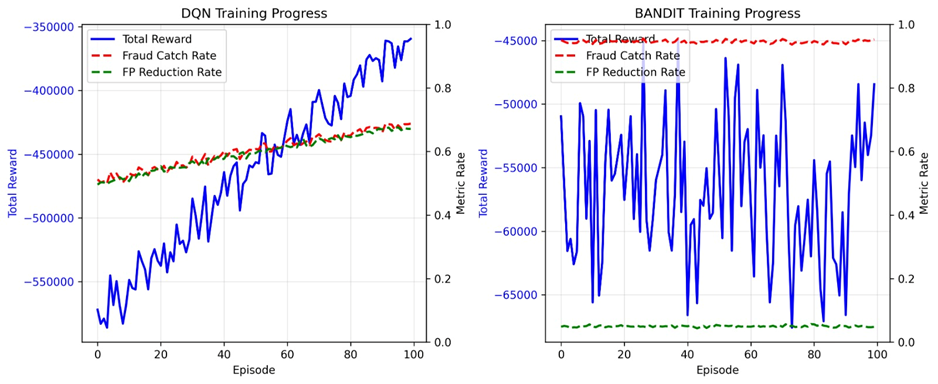

Phase 3 trains the DQN policy and compares it against static thresholds and a contextual bandit baseline.

### Phase 4: Drift Detection and Safety

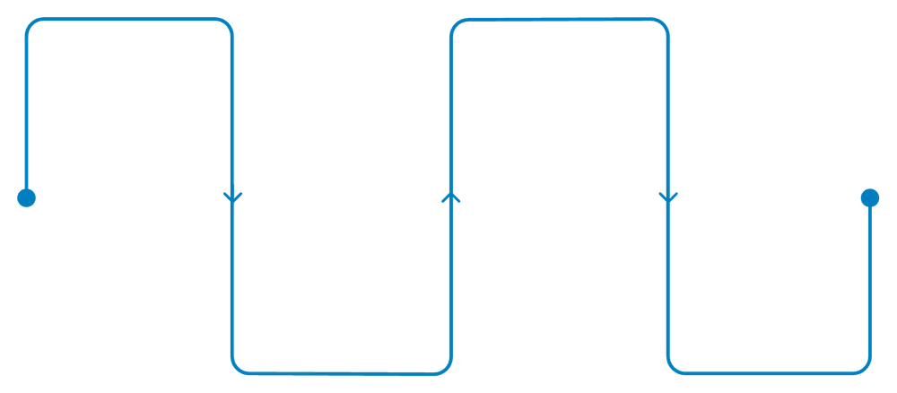

Phase 4 monitors incoming data distribution shifts using PSI and KL divergence, then activates fallback behavior when drift becomes critical.

### Phase 5: MLOps and Deployment

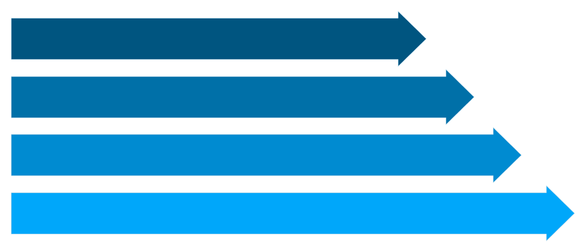

Phase 5 exposes the backend API, dashboard, model information, drift endpoints, and deployment-ready monitoring surfaces.

## API Surface

| Method | Endpoint | Purpose |
| --- | --- | --- |
| `GET` | `/` | Root health check |
| `GET` | `/health` | Detailed service health |
| `POST` | `/api/alerts/evaluate` | Evaluate one alert |
| `POST` | `/api/alerts/batch` | Evaluate alerts in batch |
| `GET` | `/api/alerts/stats` | Alert statistics |
| `POST` | `/api/pipeline/run` | Trigger pipeline execution |
| `GET` | `/api/pipeline/status` | Pipeline status |
| `GET` | `/api/pipeline/results` | Latest pipeline results |
| `POST` | `/api/drift/check` | Check drift on incoming data |
| `POST` | `/api/drift/simulate` | Simulate drift scenarios |
| `GET` | `/api/drift/status` | Current drift status |
| `GET` | `/api/models/info` | Model metadata |
| `GET` | `/api/models/comparison` | RL vs baseline comparison |
| `GET` | `/api/models/training-curves` | Training curve image |

## RL Formulation

| Component | Definition |
| --- | --- |
| State | `[prob_fraud, rule_count_norm, amount_norm, fraud_rate, workload_level]` |
| Actions | `0 = SUPPRESS`, `1 = ESCALATE` |
| Reward | Suppress fraud: `-50`, suppress benign: `+1`, escalate fraud: `+1`, escalate benign: `-0.1` |
| Objective | Maximize cumulative reward while preserving high fraud recall |

## Folder Structure

```text
AlertIQ/
|-- api/                         # FastAPI backend
|   |-- main.py
|   |-- schemas.py
|   `-- routes/
|-- frontend/                    # React + Vite dashboard
|   |-- src/
|   `-- package.json
|-- src/                         # Core ML/RL pipeline
|   |-- alert_rules.py
|   |-- analyst_simulator.py
|   |-- data_loader.py
|   |-- dataset_builder.py
|   |-- suppression_model.py
|   |-- rl_agent.py
|   |-- rl_environment.py
|   |-- rl_trainer.py
|   |-- drift_detector.py
|   `-- explainability.py
|-- outputs/                     # Generated charts and reports
|-- docs/readme-assets/          # Images extracted from the project PPTX
|-- run_all.py
|-- run_eda.py
|-- run_phase2.py
|-- run_phase3.py
|-- run_phase4_rl.py
|-- run_phase5_drift.py
|-- evaluate_metrics.py
`-- requirements.txt
```

## Business Impact


## Technology Stack

| Area | Tools |
| --- | --- |
| Machine learning | scikit-learn, NumPy, pandas |
| Reinforcement learning | PyTorch |
| Calibration and evaluation | Platt scaling, ROC-AUC, PR curves, confusion analysis |
| Drift monitoring | PSI, KL divergence |
| Backend | FastAPI, Uvicorn, Pydantic |
| Frontend | React, Vite |
| Visualization | Matplotlib, Seaborn |

## Project Team

- Krisha Shah - 24070126512
- Sahil Awatramani - 23070126112
- Janhavi Doijad - 23070126153
- Pranjali Vishwakarma - 23070126092

## References

- Mnih et al., "Human-level control through deep reinforcement learning", Nature, 2015.
- Li et al., "A contextual-bandit approach to personalized news article recommendation", JMLR, 2010.
- Elkan, "The foundations of cost-sensitive learning", SIGKDD, 2001.
- PaySim: E. Lopez-Rojas, "Applying PAYSIM financial simulator", 2016.
