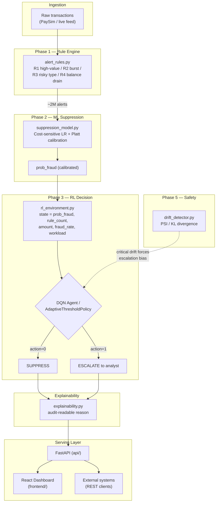

# AlertIQ

**Risk-constrained reinforcement learning for adaptive AML alert governance.**

AlertIQ is an end-to-end AI system for Anti-Money-Laundering (AML) alert
triage in banking. It combines a rule-based monitoring layer, a calibrated
fraud-risk model, a reinforcement-learning decision policy, drift/safety
monitoring, an explainability engine, a FastAPI backend, and a React
dashboard — with one goal: **cut the false-positive workload that buries
compliance analysts, without letting a single extra fraud case through.**

> Every metric quoted below comes from `outputs/rl_outputs/evaluation_report.txt`
> and the charts in `outputs/`, generated by running this project's own
> pipeline against the full 6.36M-row PaySim dataset. Nothing here is a
> projection.

---

## Table of Contents

1. [Problem Statement](#problem-statement)
2. [Approach](#approach)
3. [Core Results](#core-results)
4. [Architecture](#architecture)
5. [The 5-Phase Pipeline](#the-5-phase-pipeline)
6. [System Components](#system-components)
7. [Repository Structure](#repository-structure)
8. [Getting Started](#getting-started)
9. [Running the Tests](#running-the-tests)
10. [Running the Examples](#running-the-examples)
11. [Docker](#docker)
12. [API Reference](#api-reference)
13. [RL Formulation](#rl-formulation)
14. [Phase Outputs (Charts)](#phase-outputs-charts)
15. [Technology Stack](#technology-stack)
16. [Configuration](#configuration)
17. [Limitations & Future Work](#limitations--future-work)
18. [References](#references)
19. [License](#license)

---

## Problem Statement

AML monitoring systems are deliberately over-sensitive — missing a real
fraud case is far more costly (regulatory, financial, reputational) than
reviewing one extra benign transaction. That safety-first posture has a
predictable side effect: **alert fatigue**. Analysts spend nearly all their
time dismissing false positives, real fraud gets buried in the noise, and
review quality drops as volume rises.

On the full PaySim dataset, AlertIQ's own rule engine reproduces this
problem before solving it:

| Metric | Value |
| --- | --- |
| Raw transactions | 6,362,620 |
| Rule-based alerts generated | 2,050,000+ |
| Fraud captured by rules | 96.48% |
| Analyst reviews required (pre-AI) | 2M+ |

That's the starting point: a rule layer tuned for near-total recall,
generating a workload no human team can sustainably review.

## Approach

AlertIQ treats alert governance as a **decision problem**, not just a
classification problem. Three layers work together:

1. A **calibrated ML model** estimates the true fraud probability of each
   already-flagged alert (the rules over-alert on purpose; the model's job
   is to separate signal from noise within that alert pool).
2. A **reinforcement-learning policy** learns *when* to suppress a
   low-risk alert versus escalate it, under an asymmetric reward that makes
   missing fraud far more costly than any workload savings.
3. A **drift detector** watches for the model's world changing under it,
   and forces conservative behavior (escalate more, suppress less) the
   moment it does.

Every decision the system makes is paired with a human-readable
explanation, because in AML compliance, "the model said so" is not an
acceptable audit trail.

## Core Results

| Area | Result |
| --- | --- |
| Raw dataset | 6.36M PaySim transactions |
| Rule alerts generated | 2.05M alerts |
| Fraud capture from rules | 96.48% |
| ML model | Cost-sensitive Logistic Regression + Platt calibration |
| ROC-AUC | 0.9961 |
| Best static threshold | 0.80 |
| Fraud recall at threshold | 0.9933 |
| False-positive reduction at threshold | 0.9627 |
| RL (DQN) fraud catch rate | 0.9748 |
| RL (DQN) false-positive reduction | 0.9788 |
| RL (DQN) workload savings | 0.9751 |

Full numeric breakdown, including the static-threshold sweep the RL policy
is benchmarked against, is in
[`outputs/rl_outputs/evaluation_report.txt`](outputs/rl_outputs/evaluation_report.txt).

## Architecture


```mermaid
flowchart TB
    subgraph Ingestion
        A["Raw transactions\n(PaySim / live feed)"]
    end

    subgraph Phase1["Phase 1 — Rule Engine"]
        A --> B["alert_rules.py\nR1 high-value / R2 burst /\nR3 risky type / R4 balance drain"]
    end

    subgraph Phase2["Phase 2 — ML Suppression"]
        B -->|"~2M alerts"| C["suppression_model.py\nCost-sensitive LR + Platt calibration"]
        C --> D["prob_fraud (calibrated)"]
    end

    subgraph Phase3["Phase 3 — RL Decision"]
        D --> E["rl_environment.py\nstate = prob_fraud, rule_count,\namount, fraud_rate, workload"]
        E --> F{"DQN Agent /\nAdaptiveThresholdPolicy"}
        F -->|"action=0"| G["SUPPRESS"]
        F -->|"action=1"| H["ESCALATE to analyst"]
    end

    subgraph Phase5["Phase 5 — Safety"]
        I["drift_detector.py\nPSI / KL divergence"] -.->|"critical drift forces\nescalation bias"| F
    end

    subgraph Explain["Explainability"]
        G --> J["explainability.py\naudit-readable reason"]
        H --> J
    end

    subgraph Serve["Serving Layer"]
        J --> K["FastAPI (api/)"]
        K --> L["React Dashboard\n(frontend/)"]
        K --> M["External systems\n(REST clients)"]
    end
```

The same flow underpins both the offline batch pipeline (`run_all.py`) and
the live API (`api/main.py`) — the API simply runs one alert at a time
through the same functions the pipeline scripts call in bulk.

## The 5-Phase Pipeline

**Phase 1 — Data and rules.** Load PaySim transactions, engineer
AML-relevant features (transaction bursts, balance-drain ratios, type
encoding), and apply four interpretable rules to generate the initial
alert pool. This is the "legacy system" baseline: high recall, terrible
precision, by design.

**Phase 2 — ML suppression.** Train a cost-sensitive logistic regression
(50:1 penalty for missing fraud) wrapped in Platt-scaling calibration, so
its output isn't just a ranking but a genuinely interpretable probability
— required for the RL state space and for audit explanations downstream.

**Phase 3 — RL optimization.** Model alert governance as a sequential
decision problem. A Deep Q-Network learns a suppress/escalate policy under
an asymmetric reward (see [RL Formulation](#rl-formulation)), trained with
balanced experience replay so the ~0.1% fraud rate doesn't starve learning.
It's benchmarked against a family of static thresholds and a contextual
bandit baseline.

**Phase 4 — Drift and safety.** Continuously compare incoming data's
distribution against the training distribution using PSI and KL
divergence. On critical drift, the system automatically biases toward
escalation rather than trusting a model that may no longer reflect
reality — see `examples/02_drift_detection_demo.py` for this in action.

**Phase 5 — API and deployment.** Serve every decision — with its
explanation — through FastAPI, and surface live metrics, drift status, and
policy comparisons through a React dashboard.

## System Components

| Layer | What it does | Source |
| --- | --- | --- |
| Rule engine | Generates AML alerts from high-value, burst, risky-type, and balance-drain rules | `src/alert_rules.py` |
| Analyst simulator | Creates labeled analyst feedback with junior/senior trust scoring | `src/analyst_simulator.py` |
| Suppression model | Produces calibrated `prob_fraud` values for the decision layer | `src/suppression_model.py` |
| Threshold evaluator | Benchmarks static gating thresholds from 0.50 to 0.99 | `src/gating_evaluator.py` |
| RL environment | Models alert governance as suppress/escalate decisions with asymmetric costs | `src/rl_environment.py` |
| DQN agent | Learns adaptive suppression policy using replay and target network stabilization | `src/rl_agent.py` |
| Drift detector | Tracks PSI and KL divergence for safety monitoring | `src/drift_detector.py` |
| Explainability engine | Produces audit-readable decision explanations | `src/explainability.py` |
| FastAPI backend | Serves evaluation, drift, model, and pipeline endpoints | `api/` |
| React dashboard | Displays live metrics, charts, research flow, and model status | `frontend/` |

## Repository Structure

```text
AlertIQ/
|-- api/                         # FastAPI backend
|   |-- main.py                  # App entry point, model loading, lifespan
|   |-- schemas.py                # Pydantic request/response models
|   `-- routes/                  # alerts.py, pipeline.py, drift.py, models.py
|-- frontend/                    # React + Vite dashboard
|   |-- src/
|   |-- Dockerfile
|   `-- package.json
|-- src/                         # Core ML/RL pipeline
|   |-- alert_rules.py
|   |-- analyst_simulator.py
|   |-- data_loader.py
|   |-- dataset_builder.py
|   |-- suppression_model.py
|   |-- gating_evaluator.py
|   |-- rl_agent.py
|   |-- rl_environment.py
|   |-- rl_trainer.py
|   |-- rl_pipeline.py
|   |-- drift_detector.py
|   |-- explainability.py
|   |-- metrics.py
|   `-- config.py                # Single source of truth for all tunables
|-- tests/                       # pytest suite (32 tests, runs in <1s)
|-- examples/                    # 4 runnable, self-contained demo scripts
|-- dataset/                     # Sample data + full-dataset instructions
|-- config/                      # Deployment env config (.env.example)
|-- docs/readme-assets/          # Supporting images
|-- outputs/                     # Generated charts and evaluation reports
|-- Dockerfile                   # Backend image
|-- docker-compose.yml           # Backend + frontend together
|-- requirements.txt             # Runtime dependencies
|-- requirements-dev.txt         # + pytest, httpx for testing
|-- run_all.py                   # Runs the full 5-phase pipeline
|-- run_eda.py / run_phase2.py / run_phase3.py / run_phase4_rl.py / run_phase5_drift.py
`-- evaluate_metrics.py
```

## Getting Started

### Prerequisites

- Python 3.10+
- Node.js 18+ (for the frontend)
- ~2 GB free disk space if you download the full PaySim dataset

### Backend setup

```bash
git clone <this-repository-url>
cd AlertIQ

python -m venv venv
source venv/bin/activate        # Windows: venv\Scripts\activate
pip install -r requirements.txt
```

### Dataset setup

For a **quick look** at the system, you don't need to do anything extra —
`dataset/sample_paysim.csv` is already included and every example script
uses it automatically.

To reproduce the **actual reported metrics**, download the full dataset:

```bash
# 1. Download PS_20174392719_1491204439457_log.csv from
#    https://www.kaggle.com/datasets/ealaxi/paysim1
# 2. Place it at:
mkdir -p data
mv ~/Downloads/PS_20174392719_1491204439457_log.csv data/PaySim.csv
```

See [`dataset/README.md`](dataset/README.md) for the full schema and more detail.

### Run the full pipeline

```bash
python run_all.py
```

Or run phases individually (useful for debugging or re-running just one stage):

```bash
python run_eda.py
python run_phase2.py
python run_phase3.py
python run_phase4_rl.py
python run_phase5_drift.py
```

### Start the API

```bash
python -m uvicorn api.main:app --reload --port 8000
```

Open the interactive docs at [http://localhost:8000/docs](http://localhost:8000/docs).
The API starts fine even without a trained model — it falls back to a
static-threshold decision and a neutral 0.5 probability until you've run
the pipeline (see [API Reference](#api-reference)).

### Start the frontend

```bash
cd frontend
npm install
npm run dev
```

The Vite dev server prints the local dashboard URL, usually
[http://localhost:5173](http://localhost:5173).

## Running the Tests

```bash
pip install -r requirements-dev.txt
pytest
```

32 tests, running in well under a second, with **no dataset download and
no trained model required** — everything runs against the synthetic
sample in `dataset/` and in-memory fixtures. Coverage includes:

| File | What it checks |
| --- | --- |
| `tests/test_alert_rules.py` | Rule engine output shape, high-value threshold logic, fraud recall on realistic data |
| `tests/test_drift_detector.py` | PSI/KL correctness on identical vs. shifted distributions, fallback bias activation |
| `tests/test_rl_environment.py` | Asymmetric reward values match `src/config.py`, episode bookkeeping, balanced sampling, the adaptive-threshold baseline policy |
| `tests/test_explainability.py` | Risk classification, template selection, drift-override explanations |
| `tests/test_config.py` | Safety invariants — e.g. the missed-fraud penalty must always dominate every other reward |
| `tests/test_api.py` | FastAPI endpoints respond correctly in cold-start (no model loaded) mode |

## Running the Examples

Four scripts in `examples/` walk through the real pipeline code end-to-end
using the bundled sample dataset — see [`examples/README.md`](examples/README.md)
for details and sample output. Quick start:

```bash
python examples/01_rule_engine_walkthrough.py
python examples/02_drift_detection_demo.py
python examples/03_decision_explainability_walkthrough.py

# In a separate terminal:
uvicorn api.main:app --reload --port 8000
# Then:
python examples/04_call_api_client.py
```

## Docker

```bash
docker compose up --build
```

This builds and runs the FastAPI backend (`:8000`) and the React
dashboard (`:5173`) together. Mount `outputs/` and `models/` (already
wired up in `docker-compose.yml`) if you want the container to serve a
model trained outside of Docker. See the root [`Dockerfile`](Dockerfile),
[`frontend/Dockerfile`](frontend/Dockerfile), and
[`docker-compose.yml`](docker-compose.yml).

## API Reference

| Method | Endpoint | Purpose |
| --- | --- | --- |
| `GET` | `/` | Root health check |
| `GET` | `/health` | Detailed service health |
| `POST` | `/api/alerts/evaluate` | Evaluate one alert |
| `POST` | `/api/alerts/batch` | Evaluate alerts in batch |
| `GET` | `/api/alerts/stats` | Alert statistics |
| `POST` | `/api/pipeline/run` | Trigger pipeline execution |
| `GET` | `/api/pipeline/status` | Pipeline status |
| `GET` | `/api/pipeline/results` | Latest pipeline results |
| `POST` | `/api/drift/check` | Check drift on incoming data |
| `POST` | `/api/drift/simulate` | Simulate drift scenarios |
| `GET` | `/api/drift/status` | Current drift status |
| `GET` | `/api/models/info` | Model metadata |
| `GET` | `/api/models/comparison` | RL vs baseline comparison |
| `GET` | `/api/models/training-curves` | Training curve image |

Example request/response for `POST /api/alerts/evaluate` (this exact
payload is used in `examples/04_call_api_client.py` and `tests/test_api.py`):

```json
// Request
{
  "amount": 250000.0,
  "step": 12,
  "rule_count": 2,
  "alert_reason": "R1",
  "balance_drain_ratio": 0.95,
  "oldbalanceOrg": 260000.0,
  "newbalanceOrig": 13000.0,
  "oldbalanceDest": 0.0,
  "newbalanceDest": 250000.0,
  "type_CASH_OUT": 1,
  "type_DEBIT": 0,
  "type_PAYMENT": 0,
  "type_TRANSFER": 0
}
```

```json
// Response
{
  "decision": "ESCALATE",
  "confidence": 0.5,
  "risk_level": "MEDIUM",
  "fraud_probability": 0.5,
  "explanation": "ESCALATED — Precautionary. Elevated fraud probability (50.0%); ...",
  "risk_factors": ["Elevated fraud probability (50.0%)", "..."],
  "state_features": { "fraud_probability": 0.5, "workload_level": 0.5, "..." : "..." },
  "drift_override": false
}
```

(`fraud_probability` is 0.5 here because no trained model was loaded — see
[Getting Started](#getting-started) to train one and get a calibrated score instead.)

## RL Formulation

| Component | Definition |
| --- | --- |
| State | `[prob_fraud, rule_count_norm, amount_norm, fraud_rate, workload_level]` |
| Actions | `0 = SUPPRESS`, `1 = ESCALATE` |
| Reward | Suppress fraud: `-500`, suppress benign: `+1`, escalate fraud: `+5`, escalate benign: `-0.5` (values as configured in `src/config.py`; the asymmetry — missing fraud is penalized far more than anything else is rewarded — is the property that matters, not the exact numbers) |
| Objective | Maximize cumulative reward while preserving high fraud recall |

## Phase Outputs (Charts)

All charts below are generated artifacts from this project's own pipeline
run on the full PaySim dataset (see `outputs/` and `run_eda.py` /
`evaluate_metrics.py`).

### Phase 1 — Rule-Based Alert Engine


### Phase 2 — ML Suppression Model


### Phase 3 — Reinforcement Learning


### Phase 4 — Drift Detection and Safety


### Phase 5 — Overall Benchmark


## Technology Stack

| Area | Tools |
| --- | --- |
| Machine learning | scikit-learn, NumPy, pandas |
| Reinforcement learning | PyTorch |
| Calibration and evaluation | Platt scaling, ROC-AUC, PR curves, confusion analysis |
| Drift monitoring | PSI, KL divergence |
| Backend | FastAPI, Uvicorn, Pydantic |
| Frontend | React, Vite |
| Visualization | Matplotlib, Seaborn |
| Testing | pytest, FastAPI TestClient |
| Deployment | Docker, docker-compose |

## Configuration

Deployment settings (host, port, CORS) live in `config/.env.example`.
Pipeline/model tunables (reward values, drift thresholds, RL
hyperparameters) live in `src/config.py`. See
[`config/README.md`](config/README.md) for why they're split, and
`tests/test_config.py` for the safety invariants enforced on the latter.

## Limitations & Future Work

Being upfront about scope, since these matter as much as the results:

- **Simulated data.** PaySim is a well-regarded fraud-research simulator,
  but it is still synthetic. Real banking transaction data has additional
  structure (merchant categories, cross-border patterns, device/IP
  signals) this project doesn't model.
- **Offline RL training.** The DQN is trained and evaluated on a static
  historical split, not in a live, continuously-updating loop with real
  analyst feedback — a production deployment would need online or
  periodic retraining, which `run_phase4_rl.py` and the drift detector
  are built to support but don't fully automate yet.
- **Single-institution scope.** The system reasons about one transaction
  stream at a time; it doesn't yet model cross-institution or network-level
  laundering patterns (e.g. layering across multiple accounts/banks).
  Fields like `nameOrig`/`nameDest` are used for the burst-detection rule
  (R2) but not for deeper graph-based analysis, which is a natural
  extension of this codebase.
- **Threshold sensitivity.** Both the static-threshold baseline and the
  RL policy are sensitive to the reward magnitudes in `src/config.py`;
  changing `MISSED_FRAUD_COST` or the RL reward values changes the
  recall/workload trade-off, and should always be re-validated against
  the fraud-recall floor before deployment.
- **Explainability is template-based, not causal.** `explainability.py`
  produces structured, audit-readable reasoning from the state features
  and rule triggers — it's not a formal causal attribution (e.g. SHAP)
  over the underlying model. Adding that is a natural next step for
  deeper regulatory scrutiny.

## References

- Mnih et al., "Human-level control through deep reinforcement learning", Nature, 2015.
- Li et al., "A contextual-bandit approach to personalized news article recommendation", JMLR, 2010.
- Elkan, "The foundations of cost-sensitive learning", SIGKDD, 2001.
- Lopez-Rojas, Elmir, Axelsson, "PaySim: A financial mobile money simulator for fraud detection", EMSS, 2016.

## License

Add a license before making this repository public (e.g. MIT — see
[choosealicense.com](https://choosealicense.com/)). No license file is
included yet.
