# AlertIQ

**Risk-constrained reinforcement learning for adaptive AML alert governance.**

AlertIQ is an end-to-end AI system for Anti-Money-Laundering (AML) alert
triage in banking. It combines a rule-based monitoring layer, a calibrated
fraud-risk model, a reinforcement-learning decision policy, drift/safety
monitoring, an explainability engine, a FastAPI backend, and a React
dashboard — with one goal: **cut the false-positive workload that buries
compliance analysts, without letting a single extra fraud case through.**

> Every metric quoted below comes from `outputs/rl_outputs/evaluation_report.txt`
> and the charts in `outputs/`, generated by running this project's own
> pipeline against the full 6.36M-row PaySim dataset. Nothing here is a
> projection.

---

## Table of Contents

1. [Problem Statement](#problem-statement)
2. [Approach](#approach)
3. [Core Results](#core-results)
4. [Architecture & Decision Flow](#architecture--decision-flow)
5. [The 5-Phase Pipeline](#the-5-phase-pipeline)
6. [System Components](#system-components)
7. [Repository Structure](#repository-structure)
8. [Reference Guide to Run and Use the Application](#reference-guide-to-run-and-use-the-application)
   - [1. Prerequisites](#1-prerequisites)
   - [2. Installation](#2-installation)
   - [3. Running the Full Pipeline](#3-running-the-full-pipeline)
   - [4. Running the Test Suite](#4-running-the-test-suite)
   - [5. Running the API](#5-running-the-api)
   - [6. Running the Frontend Dashboard](#6-running-the-frontend)
   - [7. Docker Deployment (All-in-One)](#7-docker-all-in-one-deployment)
   - [Dataset Setup (Sample vs. Full Dataset)](#dataset-setup)
9. [Running the Examples](#running-the-examples)
10. [API Reference](#api-reference)
11. [RL Formulation](#rl-formulation)
12. [Phase Outputs (Charts)](#phase-outputs-charts)
13. [Technology Stack](#technology-stack)
14. [Configuration](#configuration)
15. [Limitations & Future Work](#limitations--future-work)
16. [References](#references)
17. [License](#license)

---

## Problem Statement

AML monitoring systems are deliberately over-sensitive — missing a real
fraud case is far more costly (regulatory, financial, reputational) than
reviewing one extra benign transaction. That safety-first posture has a
predictable side effect: **alert fatigue**. Analysts spend nearly all their
time dismissing false positives, real fraud gets buried in the noise, and
review quality drops as volume rises.

On the full PaySim dataset, AlertIQ's own rule engine reproduces this
problem before solving it:

| Metric | Value |
| --- | --- |
| Raw transactions | 6,362,620 |
| Rule-based alerts generated | 2,050,000+ |
| Fraud captured by rules | 96.48% |
| Analyst reviews required (pre-AI) | 2M+ |

That's the starting point: a rule layer tuned for near-total recall,
generating a workload no human team can sustainably review.

## Approach

AlertIQ treats alert governance as a **decision problem**, not just a
classification problem. Three layers work together:

1. A **calibrated ML model** estimates the true fraud probability of each
   already-flagged alert (the rules over-alert on purpose; the model's job
   is to separate signal from noise within that alert pool).
2. A **reinforcement-learning policy** learns *when* to suppress a
   low-risk alert versus escalate it, under an asymmetric reward that makes
   missing fraud far more costly than any workload savings.
3. A **drift detector** watches for the model's world changing under it,
   and forces conservative behavior (escalate more, suppress less) the
   moment it does.

Every decision the system makes is paired with a human-readable
explanation, because in AML compliance, "the model said so" is not an
acceptable audit trail.

## Core Results

| Area | Result |
| --- | --- |
| Raw dataset | 6.36M PaySim transactions |
| Rule alerts generated | 2.05M alerts |
| Fraud capture from rules | 96.48% |
| ML model | Cost-sensitive Logistic Regression + Platt calibration |
| ROC-AUC | 0.9961 |
| Best static threshold | 0.80 |
| Fraud recall at threshold | 0.9933 |
| False-positive reduction at threshold | 0.9627 |
| RL (DQN) fraud catch rate | 0.9748 |
| RL (DQN) false-positive reduction | 0.9788 |
| RL (DQN) workload savings | 0.9751 |

Full numeric breakdown, including the static-threshold sweep the RL policy
is benchmarked against, is in
[`outputs/rl_outputs/evaluation_report.txt`](outputs/rl_outputs/evaluation_report.txt).

## Architecture & Decision Flow

### End-to-End System Architecture

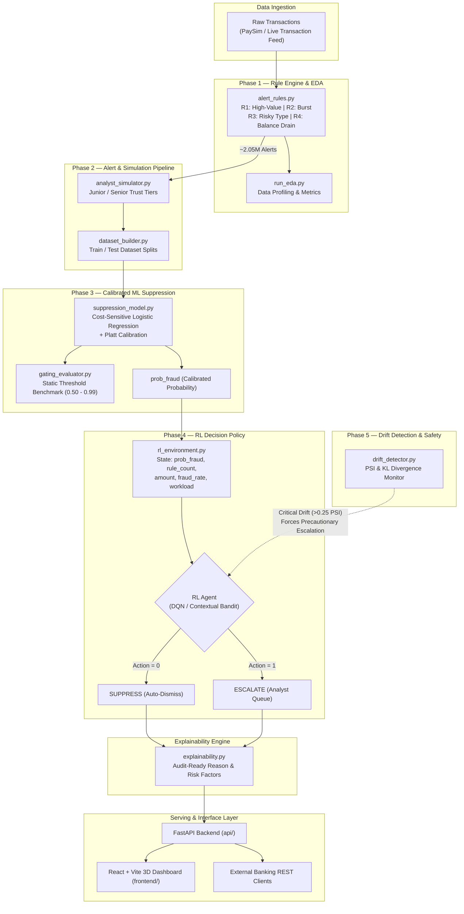
```mermaid
flowchart TB
    subgraph Ingestion["Data Ingestion"]
        A["Raw Transactions\n(PaySim / Live Transaction Feed)"]
    end

    subgraph Phase1["Phase 1 — Rule Engine & EDA"]
        A --> B["alert_rules.py\nR1: High-Value | R2: Burst\nR3: Risky Type | R4: Balance Drain"]
        B --> EDA["run_eda.py\nData Profiling & Metrics"]
    end

    subgraph Phase2["Phase 2 — Alert & Simulation Pipeline"]
        B -->|"~2.05M Alerts"| C["analyst_simulator.py\nJunior / Senior Trust Tiers"]
        C --> D["dataset_builder.py\nTrain / Test Dataset Splits"]
    end

    subgraph Phase3["Phase 3 — Calibrated ML Suppression"]
        D --> E["suppression_model.py\nCost-Sensitive Logistic Regression\n+ Platt Calibration"]
        E --> F["gating_evaluator.py\nStatic Threshold Benchmark (0.50 - 0.99)"]
        E --> G["prob_fraud (Calibrated Probability)"]
    end

    subgraph Phase4["Phase 4 — RL Decision Policy"]
        G --> H["rl_environment.py\nState: prob_fraud, rule_count,\namount, fraud_rate, workload"]
        H --> I{"RL Agent\n(DQN / Contextual Bandit)"}
        I -->|"Action = 0"| J["SUPPRESS (Auto-Dismiss)"]
        I -->|"Action = 1"| K["ESCALATE (Analyst Queue)"]
    end

    subgraph Phase5["Phase 5 — Drift Detection & Safety"]
        L["drift_detector.py\nPSI & KL Divergence Monitor"] -.->|"Critical Drift (>0.25 PSI)\nForces Precautionary Escalation"| I
    end

    subgraph Explain["Explainability Engine"]
        J --> M["explainability.py\nAudit-Ready Reason & Risk Factors"]
        K --> M
    end

    subgraph Serve["Serving & Interface Layer"]
        M --> N["FastAPI Backend (api/)"]
        N --> O["React + Vite 3D Dashboard (frontend/)"]
        N --> P["External Banking REST Clients"]
    end
```

### Alert Decision Lifecycle

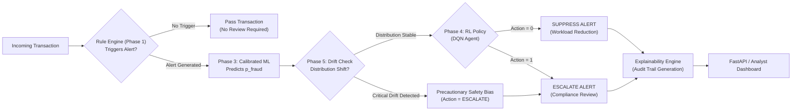
```mermaid
flowchart LR
    Tx["Incoming Transaction"] --> RuleCheck{"Rule Engine (Phase 1)\nTriggers Alert?"}
    RuleCheck -- "No Trigger" --> Pass["Pass Transaction\n(No Review Required)"]
    RuleCheck -- "Alert Generated" --> MLModel["Phase 3: Calibrated ML\nPredicts p_fraud"]
    
    MLModel --> DriftGuard{"Phase 5: Drift Check\nDistribution Shift?"}
    
    DriftGuard -- "Critical Drift Detected" --> Fallback["Precautionary Safety Bias\n(Action = ESCALATE)"]
    DriftGuard -- "Distribution Stable" --> RLDecision{"Phase 4: RL Policy\n(DQN Agent)"}
    
    RLDecision -- "Action = 0" --> Suppress["SUPPRESS ALERT\n(Workload Reduction)"]
    RLDecision -- "Action = 1" --> Escalate["ESCALATE ALERT\n(Compliance Review)"]
    Fallback --> Escalate
    
    Suppress --> ExplainEngine["Explainability Engine\n(Audit Trail Generation)"]
    Escalate --> ExplainEngine
    
    ExplainEngine --> LiveAPI["FastAPI / Analyst Dashboard"]
```

## The 5-Phase Pipeline

AlertIQ is organized into a modular, 5-phase pipeline that can be executed end-to-end or inspected phase by phase:

- **Phase 1 — Exploratory Data Analysis & Rule Engine (`run_eda.py`):** Loads PaySim transactions, profiles class distributions and temporal fraud rates, engineers features (transaction bursts, balance-drain ratios, type encoding), and applies four interpretable heuristic rules (R1 High-Value, R2 Burst, R3 Risky Type, R4 Balance Drain) to establish the legacy system baseline.
- **Phase 2 — Data Pipeline & Feedback Simulation (`run_phase2.py`):** Extracts rule-triggered alerts, simulates realistic analyst investigation feedback with parameterized error rates across junior and senior analyst tiers, and creates reproducible train/test splits in `outputs/`.
- **Phase 3 — ML Suppression & Threshold Sweeps (`run_phase3.py`):** Trains a cost-sensitive logistic regression model (with a 50:1 penalty for missed fraud) paired with Platt scaling to output well-calibrated posterior probabilities. Benchmarks static decision thresholds from 0.50 to 0.99.
- **Phase 4 — Reinforcement Learning Decision Policy (`run_phase4_rl.py`):** Formulates alert triage as a Markov Decision Process (MDP). Trains a Deep Q-Network (DQN) with balanced experience replay to prevent sparse fraud signals from starving the agent, benchmarking against static thresholds and contextual bandits.
- **Phase 5 — Drift Detection & Safety Testing (`run_phase5_drift.py`):** Continuously monitors incoming feature distributions using Population Stability Index (PSI) and Kullback-Leibler (KL) divergence. Simulates distribution shifts and triggers automatic fallback action biasing toward escalation during anomalies.

## System Components

| Phase / Layer | What it does | Source Code | Output Artifacts |
| --- | --- | --- | --- |
| **Phase 1: Rule Engine & EDA** | Generates AML alerts from heuristic rules; produces comprehensive data visualizations | `src/alert_rules.py`<br>`run_eda.py` | `outputs/eda/`<br>`outputs/transaction_type_chart.png` |
| **Phase 2: Feedback Simulation** | Simulates analyst review tiers (junior/senior) and builds train/test partitions | `src/analyst_simulator.py`<br>`src/dataset_builder.py`<br>`run_phase2.py` | `outputs/train_alerts.csv`<br>`outputs/test_alerts.csv` |
| **Phase 3: Calibrated ML** | Produces calibrated `prob_fraud` scores and evaluates static gating thresholds | `src/suppression_model.py`<br>`src/gating_evaluator.py`<br>`run_phase3.py` | `models/suppression_model.joblib`<br>`outputs/evaluation/` |
| **Phase 4: RL Policy Optimization** | Trains DQN and bandit agents under asymmetric reward matrices | `src/rl_agent.py`<br>`src/rl_environment.py`<br>`src/rl_pipeline.py`<br>`run_phase4_rl.py` | `outputs/rl_outputs/`<br>`outputs/rl_outputs/evaluation_report.txt` |
| **Phase 5: Drift & Safety Guardrails** | Tracks feature drift (PSI/KL) and applies safety escalation overrides | `src/drift_detector.py`<br>`run_phase5_drift.py` | `outputs/evaluation/13_drift_analysis.png` |
| **Explainability Engine** | Generates human-readable, audit-compliant decision explanations | `src/explainability.py` | Structured explanation payloads |
| **FastAPI Backend** | Serves single/batch evaluations, drift checks, and metrics via REST | `api/main.py`<br>`api/routes/` | Interactive Swagger UI (`:8000/docs`) |
| **React + Vite Dashboard** | 3D neural scene, live alert feed, model telemetry, and architecture tour | `frontend/src/` | Interactive web application (`:5173`) |

## Repository Structure

```text
AlertIQ/
|-- api/                         # FastAPI backend service
|   |-- main.py                  # App entry point, model loading, lifespan
|   |-- schemas.py                # Pydantic request/response models
|   `-- routes/                  # alerts.py, pipeline.py, drift.py, models.py
|-- frontend/                    # React + Vite interactive dashboard
|   |-- src/                     # React components, 3D scenes, live feeds
|   |-- Dockerfile               # Multi-stage Nginx build
|   `-- package.json
|-- src/                         # Core ML/RL pipeline modules
|   |-- alert_rules.py           # 4 heuristic AML rules (R1 - R4)
|   |-- analyst_simulator.py     # Labeled analyst feedback simulation
|   |-- data_loader.py           # PaySim cleaning and loading
|   |-- dataset_builder.py       # Alert dataset builder and train/test split
|   |-- suppression_model.py     # Cost-sensitive logistic regression + Platt scaling
|   |-- gating_evaluator.py      # Static threshold benchmark (0.50 - 0.99)
|   |-- rl_agent.py              # DQN and Linear Bandit agents
|   |-- rl_environment.py        # Gymnasium-compatible AML triage environment
|   |-- rl_trainer.py            # Experience replay training loops
|   |-- rl_pipeline.py           # RL orchestrator and comparator
|   |-- drift_detector.py        # PSI and KL divergence drift monitor
|   |-- explainability.py        # Audit-ready reasoning engine
|   |-- metrics.py               # Recall, FP reduction, and cost utilities
|   `-- config.py                # Central configuration and hyperparameters
|-- tests/                       # Complete pytest suite (32 tests, runs in <1s)
|-- examples/                    # 4 runnable, self-contained walkthrough scripts
|-- dataset/                     # Sample PaySim data + full-dataset instructions
|-- config/                      # Environment configurations (.env.example)
|-- docs/readme-assets/          # Architecture and result diagrams
|-- outputs/                     # Generated charts and evaluation reports
|-- Dockerfile                   # Python backend container definition
|-- docker-compose.yml           # Multi-container orchestration (backend + frontend)
|-- requirements.txt             # Core Python runtime dependencies
|-- requirements-dev.txt         # Development & test dependencies (pytest, httpx)
|-- run_all.py                   # Full pipeline orchestrator (Phases 2-5)
|-- run_eda.py                   # Phase 1: EDA & rule-based alert generation
|-- run_phase2.py                # Phase 2: Data pipeline & alert simulation
|-- run_phase3.py                # Phase 3: Calibrated ML suppression & threshold sweep
|-- run_phase4_rl.py             # Phase 4: RL decision policy training (DQN & Bandit)
|-- run_phase5_drift.py          # Phase 5: Drift detection & safety guardrail demo
`-- evaluate_metrics.py          # Comprehensive metrics calculator
```

---

## Reference Guide to Run and Use the Application

### 1. Prerequisites

- **Python 3.10+** (required to run the backend and ML/RL pipeline)
- **Node.js 18+** (if the frontend dashboard is executed)
- **~2 GB available hard drive space** (to download and store the full PaySim database)
- **Git**
- **Docker & Docker Compose** (optional, for all-in-one containerized deployment)

---

### 2. Installation

Clone the repository and set up a Python virtual environment:

```bash
git clone https://github.com/Krishaaashah/AlertIQ
cd AlertIQ

python -m venv venv
source venv/bin/activate    # Windows: venv\Scripts\activate

pip install -r requirements.txt
```

---

### 3. Running the Full Pipeline

You can execute the entire pipeline with a single command:

```bash
python run_all.py
```

#### Or phase by phase:

```bash
python run_eda.py           # Phase 1: data exploration + rule-based alerts
python run_phase2.py        # Phase 2: train + calibrate the ML suppression model (data pipeline)
python run_phase3.py        # Phase 3: threshold sweep / gating evaluation
python run_phase4_rl.py     # Phase 4: train and evaluate the RL agent
python run_phase5_drift.py  # Phase 5: drift detection demo
```

---

### 4. Running the Test Suite

Run the full test suite without needing to download the large dataset or pretrain models:

```bash
pip install -r requirements-dev.txt
pytest
```

> **32 tests run in <1 second** against in-memory fixtures and the bundled sample dataset.

---

### 5. Running the API

Start the FastAPI backend server:

```bash
uvicorn api.main:app --reload --port 8000
```

- **Interactive API Documentation:** [http://localhost:8000/docs](http://localhost:8000/docs)
- **Alternative Redoc:** [http://localhost:8000/redoc](http://localhost:8000/redoc)
- **Health Check:** [http://localhost:8000/health](http://localhost:8000/health)

---

### 6. Running the Frontend

Start the React + Vite dashboard:

```bash
cd frontend
npm install
npm run dev
```

- **Dashboard URL:** [http://localhost:5173](http://localhost:5173)

---

### 7. Docker (All-in-One Deployment)

To build and run both the FastAPI backend and React frontend together in Docker containers:

```bash
docker compose up --build
```

- Backend API is accessible at `http://localhost:8000`
- Frontend Dashboard is accessible at `http://localhost:5173`

---

### Dataset Setup

- **Quick Start:** For immediate testing, `dataset/sample_paysim.csv` is already included. All example scripts and tests work out-of-the-box.
- **Full Dataset (for reproducing exact research metrics):**
  1. Download `PS_20174392719_1491204439457_log.csv` from [Kaggle PaySim Dataset](https://www.kaggle.com/datasets/ealaxi/paysim1).
  2. Place it in the `data/` directory:
     ```bash
     mkdir -p data
     # Move and rename the downloaded file:
     mv ~/Downloads/PS_20174392719_1491204439457_log.csv data/PaySim.csv
     ```
  3. Run `python run_all.py` to process the full 6.36M transactions.
  4. See [`dataset/README.md`](dataset/README.md) for full schema details.

---

## API Reference

| Method | Endpoint | Purpose |
| --- | --- | --- |
| `GET` | `/` | Root health check |
| `GET` | `/health` | Detailed service health |
| `POST` | `/api/alerts/evaluate` | Evaluate one alert |
| `POST` | `/api/alerts/batch` | Evaluate alerts in batch |
| `GET` | `/api/alerts/stats` | Alert statistics |
| `POST` | `/api/pipeline/run` | Trigger pipeline execution |
| `GET` | `/api/pipeline/status` | Pipeline status |
| `GET` | `/api/pipeline/results` | Latest pipeline results |
| `POST` | `/api/drift/check` | Check drift on incoming data |
| `POST` | `/api/drift/simulate` | Simulate drift scenarios |
| `GET` | `/api/drift/status` | Current drift status |
| `GET` | `/api/models/info` | Model metadata |
| `GET` | `/api/models/comparison` | RL vs baseline comparison |
| `GET` | `/api/models/training-curves` | Training curve image |

Example request/response for `POST /api/alerts/evaluate` (this exact
payload is used in `examples/04_call_api_client.py` and `tests/test_api.py`):

```json
// Request
{
  "amount": 250000.0,
  "step": 12,
  "rule_count": 2,
  "alert_reason": "R1",
  "balance_drain_ratio": 0.95,
  "oldbalanceOrg": 260000.0,
  "newbalanceOrig": 13000.0,
  "oldbalanceDest": 0.0,
  "newbalanceDest": 250000.0,
  "type_CASH_OUT": 1,
  "type_DEBIT": 0,
  "type_PAYMENT": 0,
  "type_TRANSFER": 0
}
```

```json
// Response
{
  "decision": "ESCALATE",
  "confidence": 0.5,
  "risk_level": "MEDIUM",
  "fraud_probability": 0.5,
  "explanation": "ESCALATED — Precautionary. Elevated fraud probability (50.0%); ...",
  "risk_factors": ["Elevated fraud probability (50.0%)", "..."],
  "state_features": { "fraud_probability": 0.5, "workload_level": 0.5, "..." : "..." },
  "drift_override": false
}
```

(`fraud_probability` is 0.5 here because no trained model was loaded — see
[Reference Guide to Run and Use the Application](#reference-guide-to-run-and-use-the-application) to train one and get a calibrated score instead.)

## RL Formulation

| Component | Definition |
| --- | --- |
| State | `[prob_fraud, rule_count_norm, amount_norm, fraud_rate, workload_level]` |
| Actions | `0 = SUPPRESS`, `1 = ESCALATE` |
| Reward | Suppress fraud: `-500`, suppress benign: `+1`, escalate fraud: `+5`, escalate benign: `-0.5` (values as configured in `src/config.py`; the asymmetry — missing fraud is penalized far more than anything else is rewarded — is the property that matters, not the exact numbers) |
| Objective | Maximize cumulative reward while preserving high fraud recall |

## Phase Outputs (Charts)

All charts below are generated artifacts from this project's own pipeline
run on the full PaySim dataset (see `outputs/` and `run_eda.py` /
`evaluate_metrics.py`).

### Phase 1 — Rule-Based Alert Engine
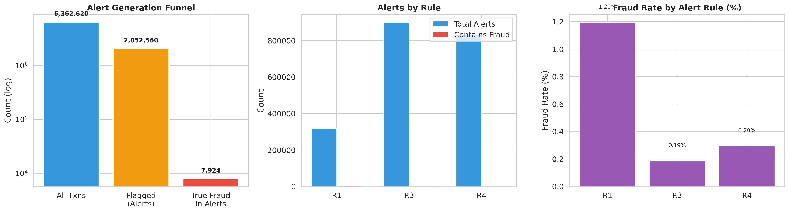
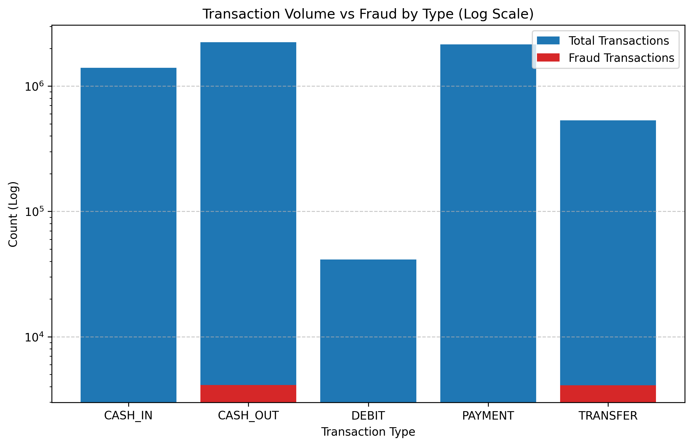

### Phase 2 — ML Suppression Model
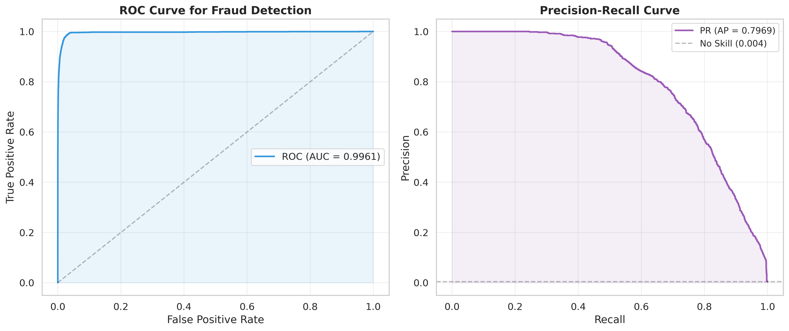
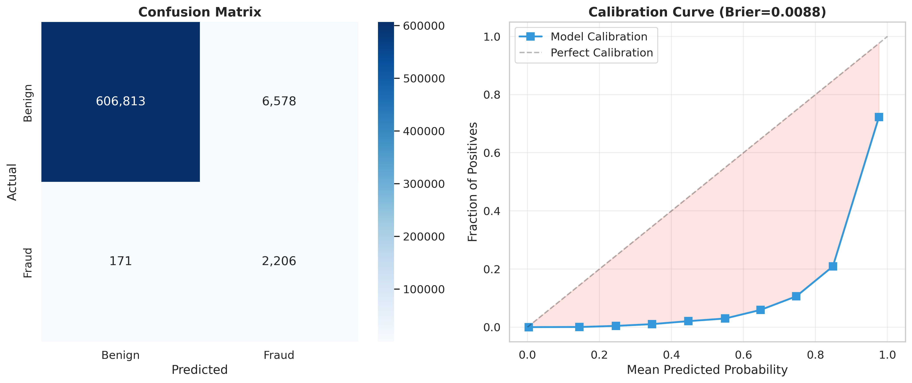
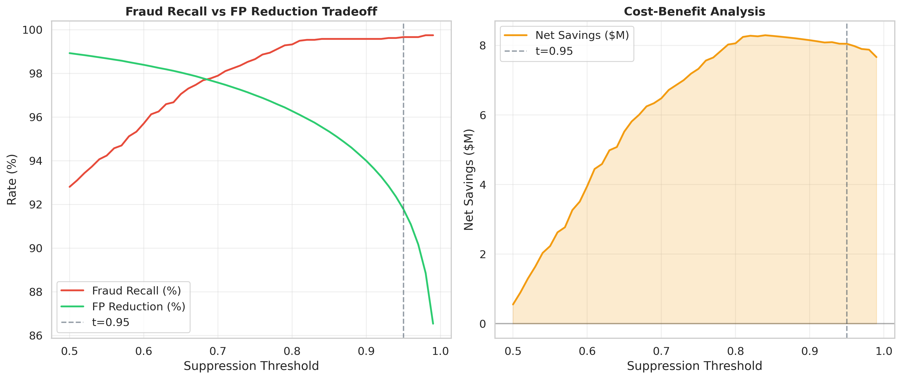

### Phase 3 — Reinforcement Learning
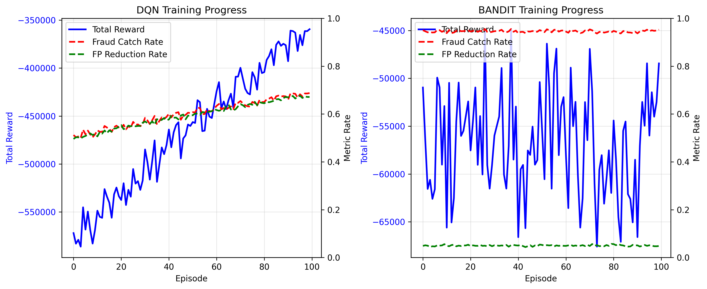
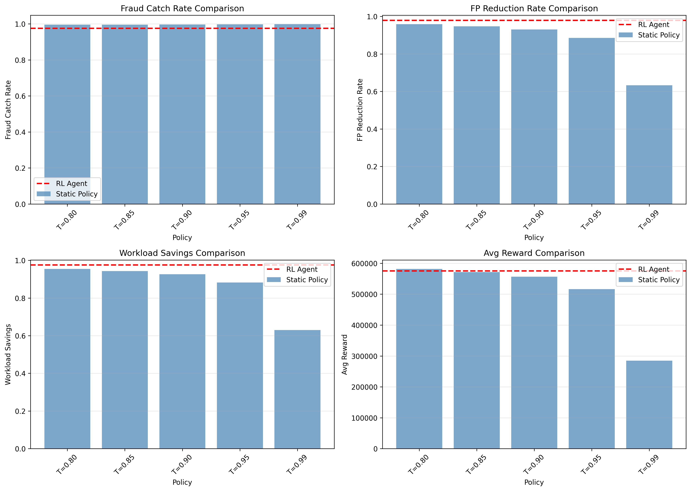

### Phase 4 — Drift Detection and Safety
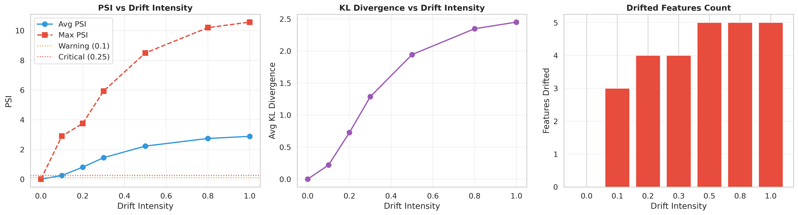

### Phase 5 — Overall Benchmark
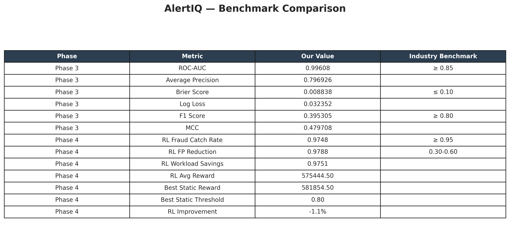

## Technology Stack

| Area | Tools |
| --- | --- |
| Machine learning | scikit-learn, NumPy, pandas |
| Reinforcement learning | PyTorch |
| Calibration and evaluation | Platt scaling, ROC-AUC, PR curves, confusion analysis |
| Drift monitoring | PSI, KL divergence |
| Backend | FastAPI, Uvicorn, Pydantic |
| Frontend | React, Vite |
| Visualization | Matplotlib, Seaborn |
| Testing | pytest, FastAPI TestClient |
| Deployment | Docker, docker-compose |

## Configuration

Deployment settings (host, port, CORS) live in `config/.env.example`.
Pipeline/model tunables (reward values, drift thresholds, RL
hyperparameters) live in `src/config.py`. See
[`config/README.md`](config/README.md) for why they're split, and
`tests/test_config.py` for the safety invariants enforced on the latter.

## Limitations & Future Work

Being upfront about scope, since these matter as much as the results:

- **Simulated data.** PaySim is a well-regarded fraud-research simulator,
  but it is still synthetic. Real banking transaction data has additional
  structure (merchant categories, cross-border patterns, device/IP
  signals) this project doesn't model.
- **Offline RL training.** The DQN is trained and evaluated on a static
  historical split, not in a live, continuously-updating loop with real
  analyst feedback — a production deployment would need online or
  periodic retraining, which `run_phase4_rl.py` and the drift detector
  are built to support but don't fully automate yet.
- **Single-institution scope.** The system reasons about one transaction
  stream at a time; it doesn't yet model cross-institution or network-level
  laundering patterns (e.g. layering across multiple accounts/banks).
  Fields like `nameOrig`/`nameDest` are used for the burst-detection rule
  (R2) but not for deeper graph-based analysis, which is a natural
  extension of this codebase.
- **Threshold sensitivity.** Both the static-threshold baseline and the
  RL policy are sensitive to the reward magnitudes in `src/config.py`;
  changing `MISSED_FRAUD_COST` or the RL reward values changes the
  recall/workload trade-off, and should always be re-validated against
  the fraud-recall floor before deployment.
- **Explainability is template-based, not causal.** `explainability.py`
  produces structured, audit-readable reasoning from the state features
  and rule triggers — it's not a formal causal attribution (e.g. SHAP)
  over the underlying model. Adding that is a natural next step for
  deeper regulatory scrutiny.

## References

- Mnih et al., "Human-level control through deep reinforcement learning", Nature, 2015.
- Li et al., "A contextual-bandit approach to personalized news article recommendation", JMLR, 2010.
- Elkan, "The foundations of cost-sensitive learning", SIGKDD, 2001.
- Lopez-Rojas, Elmir, Axelsson, "PaySim: A financial mobile money simulator for fraud detection", EMSS, 2016.

## License

Add a license before making this repository public (e.g. MIT — see
[choosealicense.com](https://choosealicense.com/)). No license file is
included yet.
